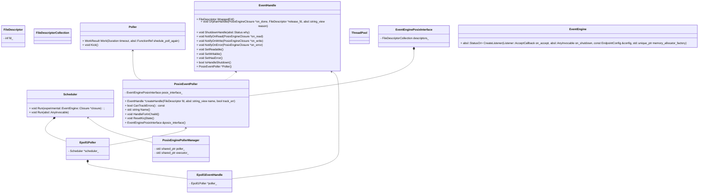

```mermaid
classDiagram
class FileDescriptor {
  - inf fd_
}
class FileDescriptorCollection {
}
class EventEnginePosixInterface {
  - FileDescriptorCollection descriptors_
}
class Poller {
  + WorkResult Work(Duration timeout, absl::FunctionRef<void()> shedule_poll_again)
  + void Kick()
}
class Scheduler {
  + void Run(experimental::EventEngine::Closure *closure);
  + void Run(absl::AnyInvocable<void()>)
}
class ThreadPool {
}
class EventHandle {
  + FileDescriptor WrappedFd()
  + void OrphanHandle(PosixEngineClosure *on_done, FileDescriptor *release_fd, absl::string_view reason)
  + void ShutdownHandle(absl::Status why)
  + void NotifyOnRead(PosixEngineClosure *on_read)
  + void NotifyOnWrite(PosixEngineClosure *on_write)
  + void NotifyOnError(PosixEngineClosure *on_error)
  + void SetReadable()
  + void SetWritable()
  + void SetHasError()
  + bool IsHandleShutdown()
  + PosixEventPoller *Poller()
}
class PosixEventPoller {
  - EventEnginePosixInterface posix_interface_
  + EventHandle *createHandle(FileDescriptor fd, absl::string_view name, bool track_err)
  + bool CanTrackErrors() const
  + std::string Name()
  + void HandleForInChaild()
  + void ResetKicjState()
  + EventEnginePosixInterface &posix_interface()
}
Poller <-- PosixEventPoller
EventEnginePosixInterface *-- PosixEventPoller
EventHandle <.. PosixEventPoller

class Epoll1EventHandle {
  - Epoll1Poller *poller_
}
EventHandle <-- Epoll1EventHandle
Epoll1Poller *-- Epoll1EventHandle
class Epoll1Poller {
  - Scheduler *scheduler_
}
PosixEventPoller <-- Epoll1Poller
Scheduler *-- Epoll1Poller

class PosixEnginePollerManager {
  - std::shared_ptr<PosixEventPoller> poller_
  - std::shared_ptr<ThreadPool> executor_
}
Scheduler <-- PosixEnginePollerManager
class EventEngine {
+ absl::StatusOr<std::unique_ptr<Listener>> CreateListener(Listener::AcceptCallback on_accept, absl::AnyInvocable<void(absl::Status)> on_shutdown, const EndpointConfig &config, std::unique_ptr<MemoryAllocatorFactory> memory_allocator_factory)
}
```
